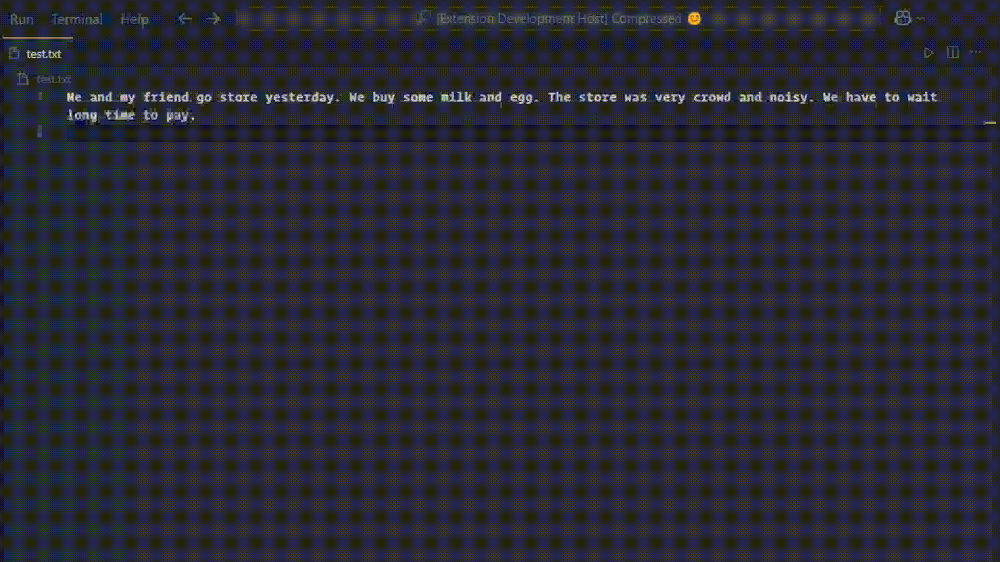

# AI Grammar Fixer

Welcome to AI Grammar Fixer, a Visual Studio Code extension that leverages AI to instantly improve your writing by fixing grammar, spelling, and style issues.

## Features

- **Instant Grammar Correction**: Select text and use the command or keybinding to fix grammar issues on the fly.
- **Emoji-Enhanced Loading Messages**: Enjoy a more engaging user experience with fun loading messages featuring emojis.
- **Notifications**: Get real-time updates on the grammar fixing process through VS Code notifications.

## Requirements

- Visual Studio Code version 1.60.0 or later
- An active internet connection for API calls to the grammar fixing service

## Installation

1. Open Visual Studio Code
2. Go to the Extensions view (`Ctrl+Shift+X` on Windows/Linux or `Cmd+Shift+X` on macOS)
3. Search for "AI Grammar Fixer"
4. Click "Install"
5. Reload VS Code if prompted

## Usage

1. Select the text you want to fix.
2. Use the command palette (`Ctrl+Shift+P` on Windows/Linux or `Cmd+Shift+P` on macOS) and search for "Fix Grammar".
3. Alternatively, use the keybinding `Ctrl+Shift+G` (Windows/Linux) or `Cmd+Shift+G` (macOS) to trigger the grammar fix.

## Extension Settings

This extension contributes the following settings:

- `aiGrammarFixer.enable`: Enable/disable the extension (default: `true`)
- `aiGrammarFixer.apiUrl`: Customize the API endpoint for grammar fixing (default: `https://grammar-fix-api.vercel.app/check-grammar`)

## Known Issues

- The extension may not work in offline mode due to its reliance on an online API.
- Very long selections might take longer to process.

## Release Notes

### 1.0.0

- Initial release of AI Grammar Fixer with basic grammar correction functionality.

### 1.0.1

- Fixed issue with notifications not appearing in Do Not Disturb mode.

### 1.1.0

- Added emoji-enhanced loading messages.
- Improved performance for larger text selections.

---

## Contributing

We welcome contributions! Please submit pull requests or open issues on our GitHub repository.

## License

This extension is licensed under the MIT License. See [LICENSE](LICENSE) for more details.

## Contact

For questions or feedback, reach out to us at support@aigrammarfixer.com or join our community on [Discord](https://discord.gg/your-invite-link).

---

## Working with Markdown

You can author your README using Visual Studio Code. Here are some useful editor keyboard shortcuts:

- Split the editor (`Cmd+\` on macOS or `Ctrl+\` on Windows and Linux)
- Toggle preview (`Shift+Cmd+V` on macOS or `Shift+Ctrl+V` on Windows and Linux)
- Press `Ctrl+Space` (Windows, Linux, macOS) to see a list of Markdown snippets

## For More Information

- [Visual Studio Code's Markdown Support](http://code.visualstudio.com/docs/languages/markdown)
- [Markdown Syntax Reference](https://help.github.com/articles/markdown-basics/)

**Happy Writing!**
