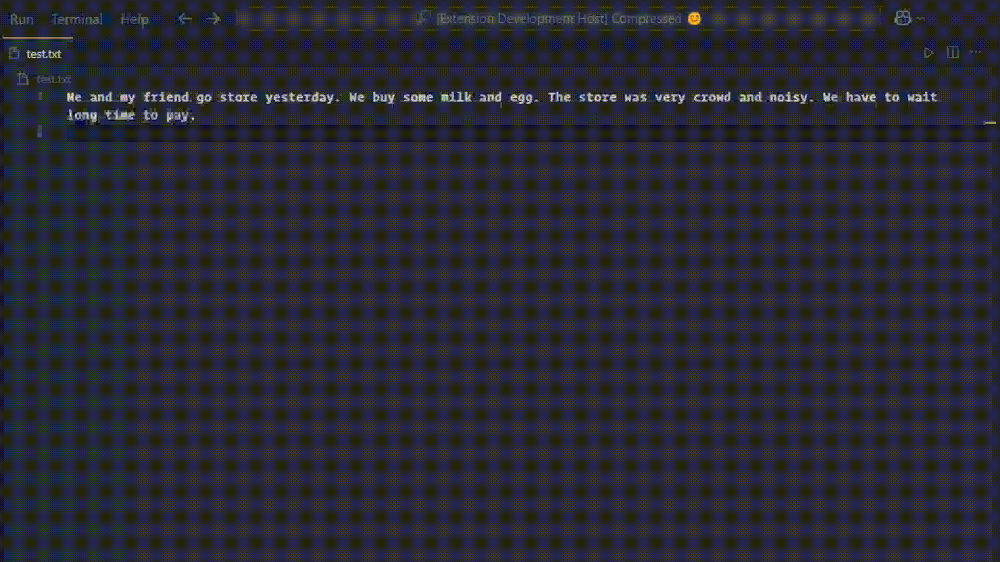

# AI Grammar Fixer

Welcome to AI Grammar Fixer, a Visual Studio Code extension that leverages AI to instantly improve your writing by fixing grammar, spelling, and style issues.

## Features

- **Instant Grammar Correction**: Select text and use the command or keybinding to fix grammar issues on the fly.

## Installation

1. Open Visual Studio Code
2. Go to the Extensions view (`Ctrl+Shift+X` on Windows/Linux or `Cmd+Shift+X` on macOS)
3. Search for "AI Grammar Fixer"
4. Click "Install"
5. Reload VS Code if prompted

## Usage

1. Select the text you want to fix.
2. Use the command palette (`Ctrl+Shift+P` on Windows/Linux or `Cmd+Shift+P` on macOS) and search for "Fix Grammar".
3. Alternatively, use the keybinding `Ctrl+Shift+G` (Windows/Linux) or `Cmd+Shift+G` (macOS) to trigger the grammar fix.

## Extension Settings

This extension contributes the following settings:

- `aiGrammarFixer.enable`: Enable/disable the extension (default: `true`)

## Known Issues

- Very long selections might take longer to process.

## Release Notes

### 0.0.1

- Initial release of AI Grammar Fixer with basic grammar correction functionality.

---

## Contributing

We welcome contributions! Please submit pull requests or open issues on our GitHub repository.

## Contact

For questions or feedback, reach out to me at [telegram](https://t.me/xmi1an).

---

**Happy Writing!**
